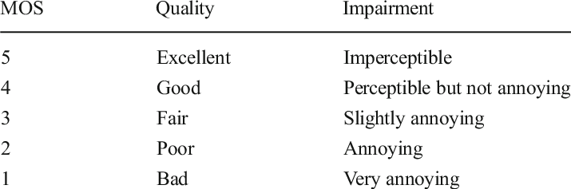

# dsp-hw

## Второе задание. Сравнение метрик

Скрипт metrics.py. Сгенерированные аудио в gen-audios. Результат автоматически сохраняется в output.md, пустые значения заполняются вручную, потом копируется сюды.

|    | Filename   |   SNR |       SDR |   SI-SDR |    PESQ | NISQA   | DNSMOS   | MOS   |
|---:|:-----------|------:|----------:|---------:|--------:|:--------|:---------|:------|
|  0 | mix_-5.wav |    -5 | -0.100994 | -50.3847 | 1.02611 | 2.313547  1.473313  4.451892  3.937768   3.408589  | 2.2666764 | 1 |
|  1 | mix_0.wav  |     0 |  2.30744  | -47.7709 | 1.03345 | 1.761629  1.283808  4.354948  3.464171   2.951612  | 2.4443219 | 1 |
|  2 | mix_5.wav  |     5 |  5.89371  | -46.1565 | 1.06993 | 1.092262  1.318367  4.329185  3.095078   2.340060  | 2.716094 | 2 |
|  3 | mix_10.wav |    10 | 10.3043   | -45.4495 | 1.18123 | 0.724490  1.349780  2.952047  1.507566   1.516691  | 3.083041 | 2.5 |

Методика для оценки MOS, которой я пользовался 

